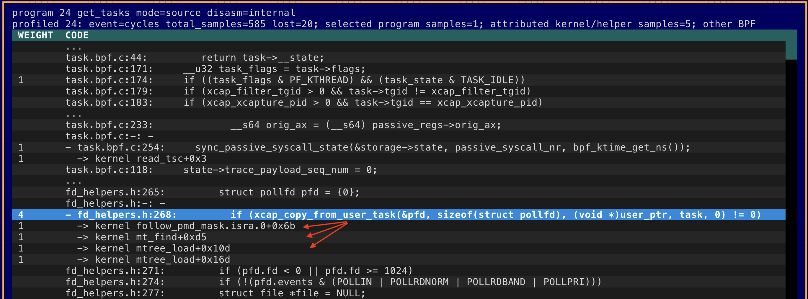

# brr: eBPF Runtime Reporter and Profiler

`brr` is the eBPF Runtime Reporter: a compact CLI and Textual TUI for listing,
inspecting, and profiling loaded Linux eBPF objects.

It is meant to feel like `ps` and `top` for eBPF. The default command opens the
live top-style TUI; `brr list` prints one loaded eBPF program per row, and other
subcommands show maps, links, BTF objects, runtime deltas, translated
instructions, source metadata, and BPF JIT CPU samples.

`brr` talks to the kernel directly through `bpf()` and `perf_event_open`. It
does not shell out to `perf`.





## Output

Program listing (`brr list`):

```text
ID  TYPE       NAME          XLATED_BYTES  JITED_BYTES
42  tracing    trace_execve  744           512
48  xdp        xdp_pass      96            64
53  cgroup_skb allow_egress  312           224
```

Runtime activity:

```text
ID  TYPE     NAME          XLATED_BYTES  JITED_BYTES  RUN_CNT_DELTA  RUN_TIME_NS_DELTA  AVG_RUN_TIME_NS
48  xdp      xdp_pass      96            64           1842           714110             387
42  tracing  trace_execve  744           512          18             28422              1579
```

Use `-x` or `--extended` to include extra columns such as `TAG` and `PINNED`.
Use `-c` or `--cumulative` with `activity` and `top` to include cumulative
runtime metrics.

JSON and CSV output are available for scripting:

```bash
sudo brr list --json --pretty
sudo brr --csv map
```

## Install

### From source with uv

Requires Linux, Python 3.11 or newer, and `uv`.

```bash
git clone https://github.com/tanelpoder/brr.git
cd brr
uv sync
sudo env PATH="$PATH" uv run brr
```

To install a local command from the checkout:

```bash
uv tool install .
sudo env PATH="$PATH" brr
```

### Debian or Ubuntu

Download the DEB for your architecture from the GitHub release, then install it:

```bash
sudo dpkg -i brr_0.5.0-1_amd64.deb
```

On ARM64:

```bash
sudo dpkg -i brr_0.5.0-1_arm64.deb
```

### Fedora, RHEL, or compatible RPM systems

Download the RPM for your architecture from the GitHub release, then install it:

```bash
sudo rpm -Uvh brr-0.5.0-1.x86_64.rpm
```

On AArch64:

```bash
sudo rpm -Uvh brr-0.5.0-1.aarch64.rpm
```

The packaged command installs as `/usr/bin/brr` and contains a standalone
binary. It does not depend on system Python.

## Usage

Most useful commands need root or equivalent Linux capabilities because they
open BPF objects and CPU-wide perf events.

List loaded eBPF programs:

```bash
sudo brr list
sudo brr list -x
```

`brr prog` remains available as a backward-compatible alias for `brr list`.

List other object types:

```bash
sudo brr map
sudo brr link
sudo brr btf
```

Include runtime counters in the program list:

```bash
sudo brr list --stats
```

Show runtime deltas:

```bash
sudo brr activity --duration 2 --limit 10
sudo brr activity -x --duration 2
sudo brr activity -c --duration 2
```

Open the interactive top-style TUI:

```bash
sudo brr
sudo brr top
sudo brr top -x
sudo brr top -c
```

Bare `brr` opens the same TUI as `brr top`; root `--bpffs`, `-x`, and `-c`
options apply to that default view. Use the explicit `top` command for options
such as `--delay`, `--event`, and `--textmode`. Bare `--json`, `--csv`, and
`--pretty` are rejected; use a subcommand such as `brr list --json`.

Inside the TUI, press `x` to toggle extended columns and `c` to toggle
cumulative columns. The live table re-enumerates loaded programs after every
completed sampling window, so newly loaded programs appear without restarting
`brr`. Refresh is intentionally paused while a program inspect/profile view is
open; press `Esc` to return to the live table.

Inspect a program by ID:

```bash
sudo brr dump 48
sudo brr top --program-id 48
sudo brr top --textmode --profile-top --program-id 48 --kernel-samples
sudo brr top --textmode --profile-top --program-id 48 --kernel-samples \
    --collapse-samples
```

Profile BPF JIT CPU samples:

```bash
sudo brr profile --duration 5 --event auto
```

`brr` drains each per-CPU perf mmap ring continuously while profiling. Ring
capacity and the maximum sweep interval are selected from the sample frequency,
record shape, online CPU count, and `kernel.perf_event_mlock_kb`. They can be
overridden when tuning or diagnosing a host:

```bash
sudo brr profile -F 997 --perf-buffer-pages 128 --perf-drain-ms 25
sudo brr profile -F 997 --fail-on-loss
```

`--perf-buffer-pages` must be `auto` or a power-of-two page count per CPU;
`--perf-drain-ms` accepts `auto` or a positive number of milliseconds. Profile
output reports ring sizing, drain count, peak occupancy, perf enabled/running
time, kernel loss/throttle records, parser discards, and warnings. With
`--fail-on-loss`, an incomplete CLI or `top --textmode` profile is still printed
but the command exits with status 1. JSON and CSV include the same capture
telemetry for automation.

Profiled inspect drilldowns label row counts as `SAMPLES` and show `%THIS`, the
row's contribution to this selected program's inclusive sampled total. Source,
instruction, and helper/kernel percentages are non-overlapping and add to
exactly 100.00%. Samples that cannot be placed on a displayed row because of
source/JIT mapping or row limits appear in an explicit `Unaccounted` row.

The compact drilldown header reports the program's total sampled CPU split into
displayed eBPF code, activity under eBPF in helpers or other kernel functions,
and unaccounted attribution. Here, 100% means one fully busy CPU, so totals may
exceed 100% on multicore systems. Normal capture telemetry is omitted from this
header; loss, multiplexing, and other capture problems still appear as
warnings. Standalone `brr profile` output and its JSON/CSV capture telemetry
remain detailed.

`top --textmode` expands helper/kernel children by default. Add
`--collapse-samples` to fold those children into their calling eBPF rows while
retaining the same 100.00% total. The option requires both `--textmode` and
`--profile-top`.

Very short BPF programs may receive only a handful of samples at 997 Hz,
especially with `cpu-clock`. For stable program and source-line rankings, use a
hardware `cycles` event when available, increase the frequency within the
host's `kernel.perf_event_max_sample_rate`, and/or profile for longer:

```bash
sudo brr profile --event cycles -F 9997 --duration 30 --fail-on-loss
sudo brr profile --event cycles -F 4999 --duration 30 --kernel-samples --fail-on-loss
```

The normal profile counts samples whose current IP is in BPF JIT code.
`--kernel-samples` also captures callchains and attributes time in kernel
helpers back to the BPF source line that called them. When comparing with
`perf`, match brr's kernel-only event scope (`cycles:k` or `cpu-clock:k`) and
compare simultaneous captures or repeated averages; adjacent sampling windows
can differ even under steady I/O. See
[Correctness validation against perf](docs/perf-correctness-validation.md) for
the methodology and measured results.

List perf events that `brr` can open on the current host:

```bash
sudo brr perf-events
```

If `brr` is installed in a user-local path and you run it with `sudo`, preserve
your `PATH`:

```bash
sudo env PATH="$PATH" brr
```

## Build Release Artifacts

Release artifacts are built locally from the current checkout. The standalone
binary is native to the build machine, so build on each target architecture.

```bash
uv sync --group dev --group package
uv run --group package python scripts/build_release.py --all
```

Artifacts are written to `dist/release/`:

- `brr-0.5.0-linux-<arch>`
- `brr_0.5.0-1_<deb-arch>.deb`
- `brr-0.5.0-1.<rpm-arch>.rpm`
- `SHA256SUMS`

## Notes

- Default bpffs path: `/sys/fs/bpf`
- Optional `bpftool`: enriches mixed inspect output when available
- `perf` command-line tool: not used by `brr`
- Runtime stats are enabled temporarily with `BPF_ENABLE_STATS`; `brr` does not
  write to `/proc/sys/kernel/bpf_stats_enabled`
