# brr

`brr` is the eBPF Runtime Reporter: a compact CLI and Textual TUI for listing,
inspecting, and profiling loaded Linux eBPF objects.

It is meant to feel like `ps` and `top` for eBPF. The default command prints one
loaded eBPF program per row; subcommands show maps, links, BTF objects, runtime
deltas, translated instructions, source metadata, and BPF JIT CPU samples.

`brr` talks to the kernel directly through `bpf()` and `perf_event_open`. It
does not shell out to `perf`.


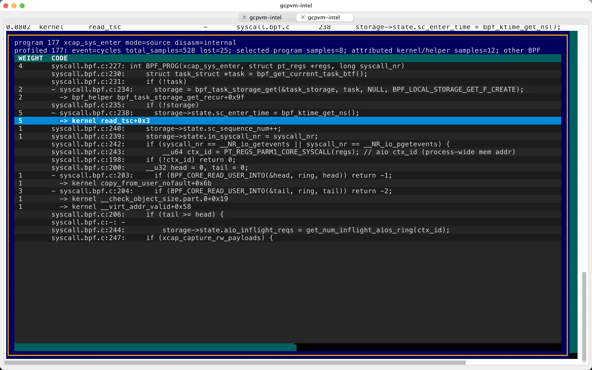

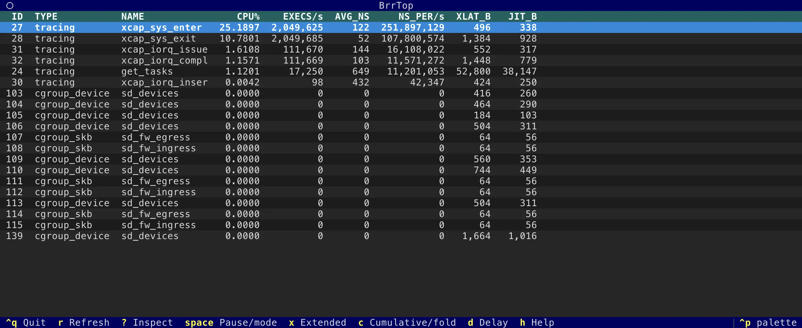

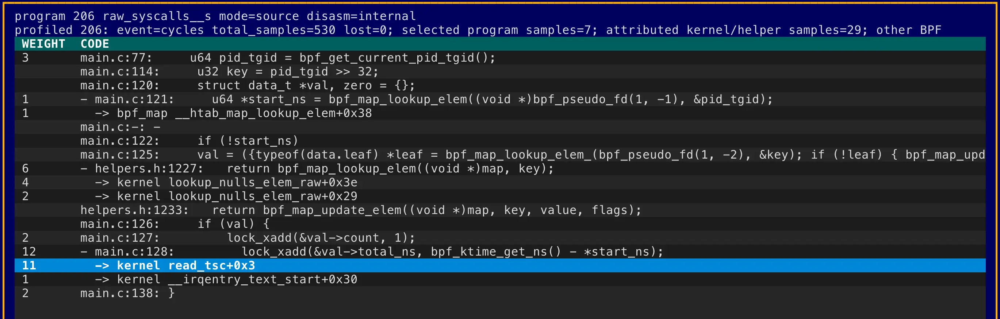

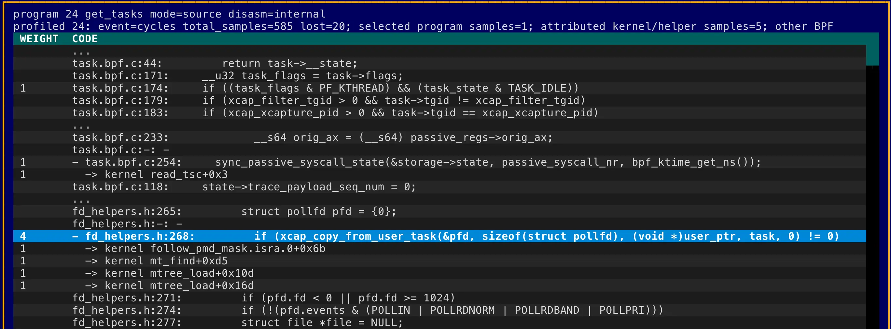

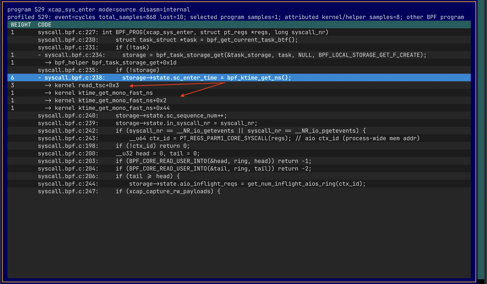

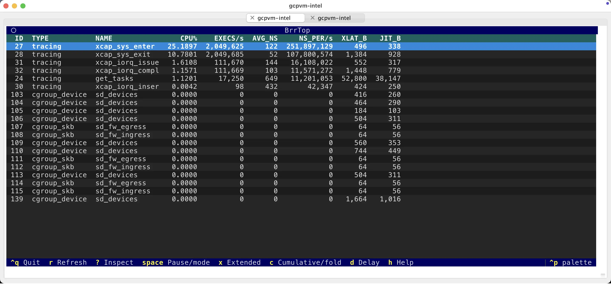

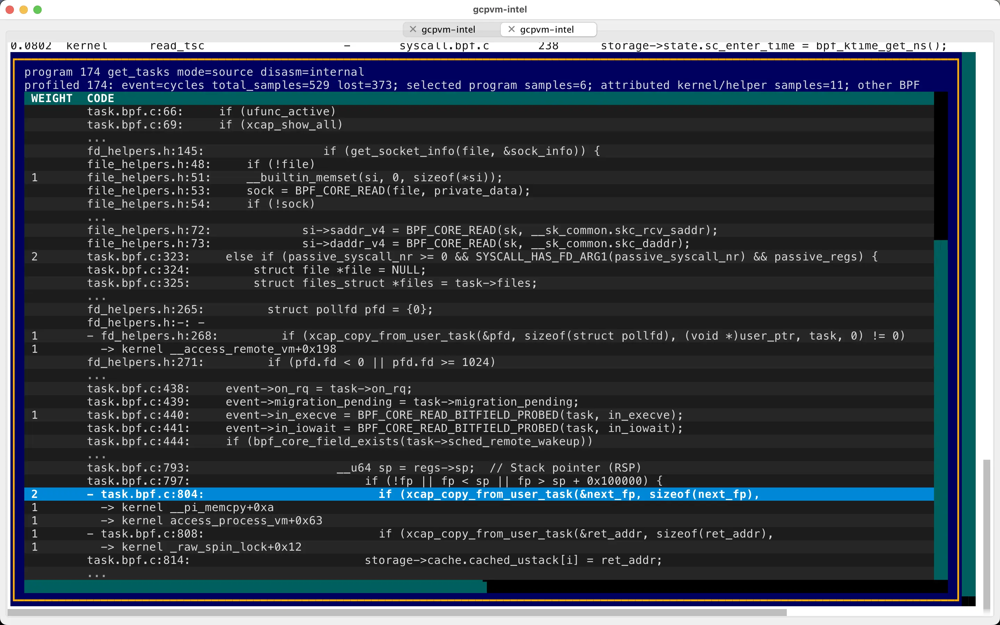

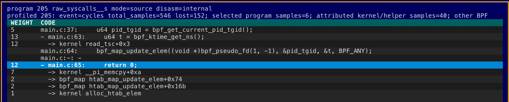

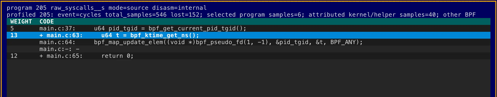


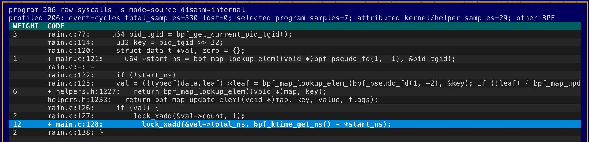

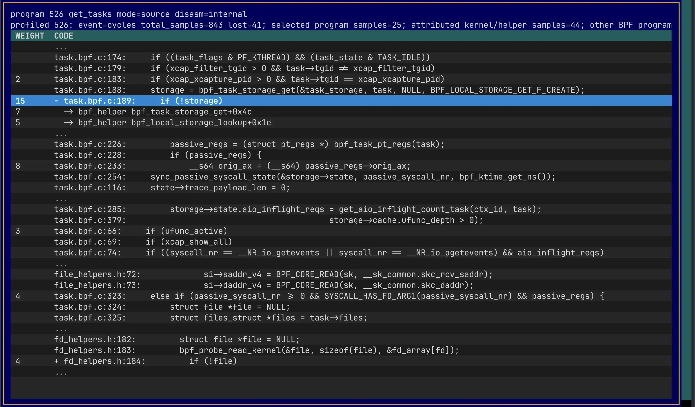


## Output

Default program listing:

```text
ID  TYPE       NAME          XLATED_BYTES  JITED_BYTES
42  tracing    trace_execve  744           512
48  xdp        xdp_pass      96            64
53  cgroup_skb allow_egress  312           224
```

Runtime activity:

```text
ID  TYPE     NAME          XLATED_BYTES  JITED_BYTES  RUN_CNT_DELTA  RUN_TIME_NS_DELTA  AVG_RUN_TIME_NS
48  xdp      xdp_pass      96            64           1842           714110             387
42  tracing  trace_execve  744           512          18             28422              1579
```

Use `-x` or `--extended` to include extra columns such as `TAG` and `PINNED`.
Use `-c` or `--cumulative` with `activity` and `top` to include cumulative
runtime metrics.

JSON and CSV output are available for scripting:

```bash
sudo brr --json --pretty
sudo brr --csv map
```

## Install

### From source with uv

Requires Linux, Python 3.11 or newer, and `uv`.

```bash
git clone https://github.com/tanelpoder/brr.git
cd brr
uv sync
sudo env PATH="$PATH" uv run brr
```

To install a local command from the checkout:

```bash
uv tool install .
sudo env PATH="$PATH" brr
```

### Debian or Ubuntu

Download the DEB for your architecture from the GitHub release, then install it:

```bash
sudo dpkg -i brr_0.4.1-1_amd64.deb
```

On ARM64:

```bash
sudo dpkg -i brr_0.4.1-1_arm64.deb
```

### Fedora, RHEL, or compatible RPM systems

Download the RPM for your architecture from the GitHub release, then install it:

```bash
sudo rpm -Uvh brr-0.4.1-1.x86_64.rpm
```

On AArch64:

```bash
sudo rpm -Uvh brr-0.4.1-1.aarch64.rpm
```

The packaged command installs as `/usr/bin/brr` and contains a standalone
binary. It does not depend on system Python.

## Usage

Most useful commands need root or equivalent Linux capabilities because they
open BPF objects and CPU-wide perf events.

List loaded eBPF programs:

```bash
sudo brr
sudo brr prog
sudo brr -x
```

List other object types:

```bash
sudo brr map
sudo brr link
sudo brr btf
```

Include runtime counters in the program list:

```bash
sudo brr prog --stats
```

Show runtime deltas:

```bash
sudo brr activity --duration 2 --limit 10
sudo brr activity -x --duration 2
sudo brr activity -c --duration 2
```

Open the interactive top-style TUI:

```bash
sudo brr top
sudo brr top -x
sudo brr top -c
```

Inside `brr top`, press `x` to toggle extended columns and `c` to toggle
cumulative columns.

Inspect a program by ID:

```bash
sudo brr dump 48
sudo brr top --program-id 48
```

Profile BPF JIT CPU samples:

```bash
sudo brr profile --duration 5 --event auto
```

List perf events that `brr` can open on the current host:

```bash
sudo brr perf-events
```

If `brr` is installed in a user-local path and you run it with `sudo`, preserve
your `PATH`:

```bash
sudo env PATH="$PATH" brr
```

## Build Release Artifacts

Release artifacts are built locally from the current checkout. The standalone
binary is native to the build machine, so build on each target architecture.

```bash
uv sync --group dev --group package
uv run --group package python scripts/build_release.py --all
```

Artifacts are written to `dist/release/`:

- `brr-0.4.1-linux-<arch>`
- `brr_0.4.1-1_<deb-arch>.deb`
- `brr-0.4.1-1.<rpm-arch>.rpm`
- `SHA256SUMS`

## Notes

- Default bpffs path: `/sys/fs/bpf`
- Optional `bpftool`: enriches mixed inspect output when available
- `perf` command-line tool: not used by `brr`
- Runtime stats are enabled temporarily with `BPF_ENABLE_STATS`; `brr` does not
  write to `/proc/sys/kernel/bpf_stats_enabled`
