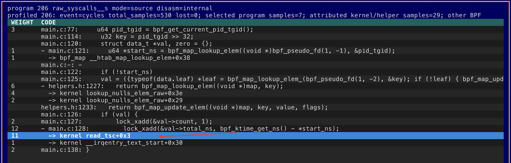
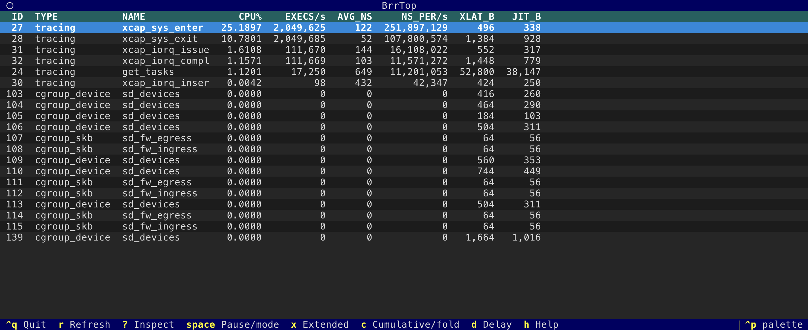
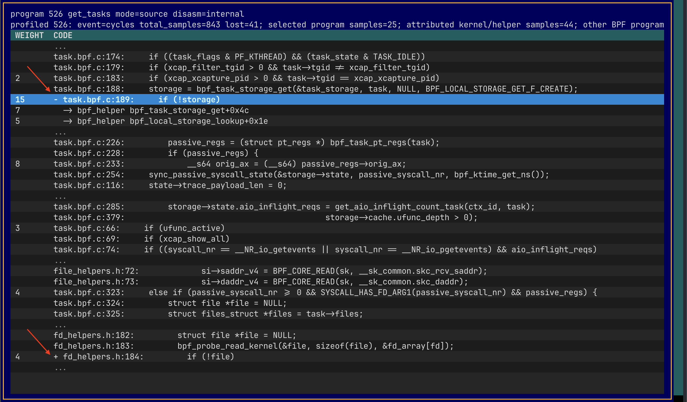
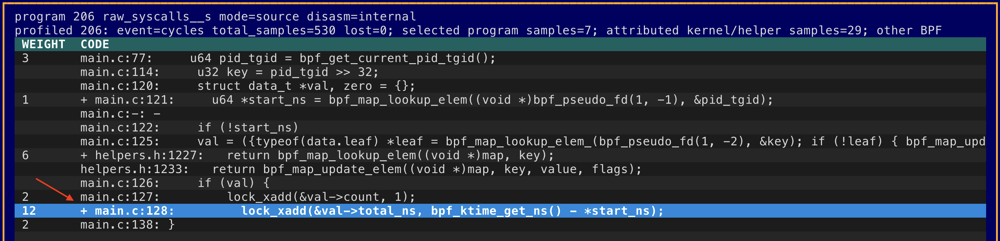
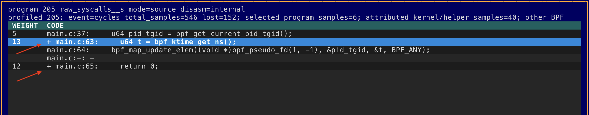
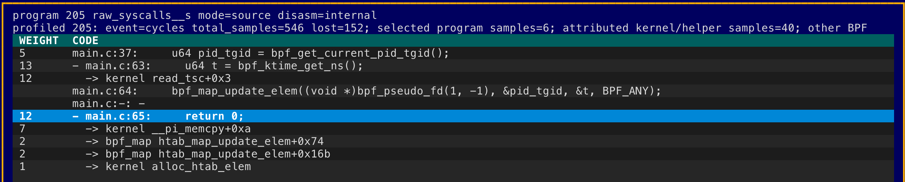
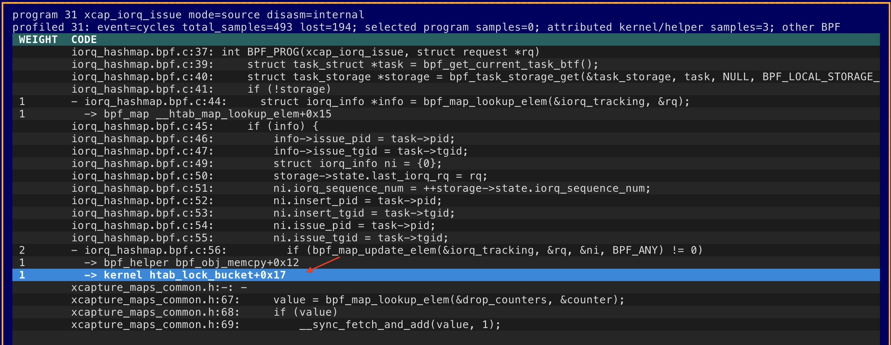
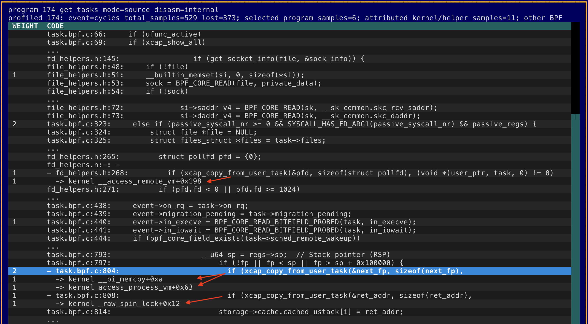

# eBPF Runtime Reporter and Profiler - brr

`brr` is the eBPF Runtime Reporter: a compact CLI and Textual TUI for listing,
inspecting, and profiling loaded Linux eBPF objects.

It is meant to feel like `ps` and `top` for eBPF. The default command opens the
live top-style TUI; `brr prog` prints one loaded eBPF program per row, and other
subcommands show maps, links, BTF objects, runtime deltas, translated
instructions, source metadata, and BPF JIT CPU samples.

`brr` talks to the kernel directly through `bpf()` and `perf_event_open`. It
does not shell out to `perf`.



Since eBPF programs are pieces of machine code residing in (kernel) address space, you can profile them with standard `perf` just like any other kernel function. However, perf alone won't show you other useful metrics like number of executions and average eBPF program runtime, like [bpftop](https://github.com/jfernandez/bpftop) does. Also, I want an easy way to map CPU samples to original source code lines, where possible.

I wanted to **unify** both approaches, display the bpftop-style call count & probe latency, with the ability to drill down into where _inside_ the eBPF program most of the time is spent. This tool is not calling the `perf` command under the hood, but uses `perf_event_open()` API directly. Also, it uses the `bpf()` syscall, for things like enabling eBPF program stats accounting (BPF\_ENABLE\_STATS) while `brr` is running.

I built this for my own use, but this tool/idea may be useful for others too. It's entirely AI-coded by Codex in Python using my specs & tests. It's been good enough for my [performance testing](https://tanelpoder.com/posts/optimizing-ebpf-biolatency-accounting/) environments (but not so sure about production :-)

1. [Jump to Installation section](#install)
1. [Jump to command line options](#command-line-options)


## Usage

`brr` runs in two modes, **`brr top`** is an interactive TUI and other options like **`brr activity`**, **`brr profile`** produce profiles in plain text output (including JSON, CSV). See [EXAMPLE\_OUTPUT.md](EXAMPLE_OUTPUT.md) for text mode profiling examples.

Here are some screenshots from running `brr top` on a machine with some sysbench & fio stress-test workloads, while multiple different eBPF monitoring/observability programs were enabled.

The landing page shows the bpftop-style program execution summary. You can press "h" to display the help menu.



I had configured my `xcapture` tool to monitor all system calls of all threads in an efficient way (tracking + sampling, not tracing), we are apparently doing 2M syscalls/s on this machine and the `xcap_sys_enter` probe used 25% of _one CPU_ time in aggregate.

Now you can use arrow keys to navigate to the program of interest and press enter to see its source code snippets (coming from each program's BTF info if available).

I picked the `get_tasks` program as it's a longer and more complex program. It's an eBPF task iterator doing _passive sampling_ of all system threads' states, without injecting any tracepoints or probes into their critical path.



The screenshot above predates the current column names: `WEIGHT` is now
`SAMPLES`, the number of perf samples attributed to that row. `%THIS` shows the
row's percentage of the selected program's inclusive samples.

You also see that some code lines have a little "+" sign in front of them. These are the CPU samples where we happened to be in some Linux _kernel_ function (not our eBPF program) - but that kernel function call was done by our eBPF program. You can press "e" to expand (and "c" to collapse) just like in perf to see the deeper stack under that eBPF program line.

So basically, I'm doing something like `perf record -g --call-graph ...` here, whenever I see a CPU sample in kernel function, I walk up the call-graph and see if the parent (or grandparent) function is our eBPF program of interest. eBPF programs can call (or fall) into Linux built-in kernel functions, as there are eBPF helper functions and other system activity like interrupts, page faults, spinlock gets, etc.

Here's an example with a `lock_xadd()` function call immediately catching (my) eyes:



But when I expand the profile with "e", I see it's actually another function call `bpf_ktime_get_ns()` passed into the `lock_xadd(...)` as an argument that calls `read_tsc()` that takes most of the time under the original function call:


Here are two examples from the `syscount` command (part of bcc-tools) when running lots of syscalls concurrently:



When expanded, we see that most of the samples fall under `__pi_memcpy` Linux kernel function:



When updating shared eBPF hash-maps under high concurrency (lots of events & lots of CPUs), then you might start seeing various "lock" functions showing up:



With modern eBPF _sleepable_ programs (that allow reading other processes memory), you might even start seeing kernel spin lock functions and page fault handlers showing up in your profiles:



Press `e` on a folded `...` row to expand source lines even when they have no
profile hits. This view is reconstructed from the program's binary metadata,
not read from the original source tree, so compiler and JIT transformations can
make the displayed source-line order look unusual.

## Output

Program listing (`brr prog`):

```text
ID  TYPE       NAME          XLATED_BYTES  JITED_BYTES
42  tracing    trace_execve  744           512
48  xdp        xdp_pass      96            64
53  cgroup_skb allow_egress  312           224
```

Runtime activity:

```text
ID  TYPE     NAME          XLATED_BYTES  JITED_BYTES  RUN_CNT_DELTA  RUN_TIME_NS_DELTA  AVG_RUN_TIME_NS
48  xdp      xdp_pass      96            64           1842           714110             387
42  tracing  trace_execve  744           512          18             28422              1579
```

Use `-x` or `--extended` to include extra columns such as `TAG` and `PINNED`.
Use `-c` or `--cumulative` with `activity` and `top` to include cumulative
runtime metrics and the `NS_PER/s` rate.

JSON and CSV output are available for scripting:

```bash
sudo env PATH="$PATH" uv run brr prog --json --pretty
sudo env PATH="$PATH" uv run brr --csv map
```

## Install

### Run from a source checkout with uv

Requires Linux, Python 3.11 or newer, and the **uv** package manager. See the
[official uv installation instructions](https://docs.astral.sh/uv/getting-started/installation/).

```bash
git clone https://github.com/tanelpoder/brr.git
cd brr
uv sync
sudo env PATH="$PATH" uv run brr prog
sudo env PATH="$PATH" uv run brr
sudo env PATH="$PATH" uv run brr profile --kernel-samples
```

Run these commands from the checkout. Preserving `PATH` lets `sudo` find the
user-installed `uv`; `uv run` then uses the checkout's managed environment.

## Command line options

Most useful commands need root or equivalent Linux capabilities because they
open BPF objects and CPU-wide perf events.


Use `--help` for the current command list and global options, or add it after a
subcommand for details, for example:

```bash
sudo env PATH="$PATH" uv run brr --help
sudo env PATH="$PATH" uv run brr top --help
sudo env PATH="$PATH" uv run brr profile --help
```

List loaded eBPF programs:

```bash
sudo env PATH="$PATH" uv run brr prog
sudo env PATH="$PATH" uv run brr prog -x
```

List other object types:

```bash
sudo env PATH="$PATH" uv run brr map
sudo env PATH="$PATH" uv run brr link
sudo env PATH="$PATH" uv run brr btf
```

Include runtime counters in the program list:

```bash
sudo env PATH="$PATH" uv run brr prog --stats
```

Show runtime deltas:

```bash
sudo env PATH="$PATH" uv run brr activity --duration 2 --limit 10
sudo env PATH="$PATH" uv run brr activity -x --duration 2
sudo env PATH="$PATH" uv run brr activity -c --duration 2
```

Open the interactive top-style TUI:

```bash
sudo env PATH="$PATH" uv run brr
sudo env PATH="$PATH" uv run brr top
sudo env PATH="$PATH" uv run brr top -x
sudo env PATH="$PATH" uv run brr top -c
```

Bare `brr` accepts the same options and opens the same TUI as `brr top`, so, for
example, `brr -d 10` is equivalent to `brr top -d 10`. Bare `--json`, `--csv`,
and `--pretty` are rejected; use a subcommand such as `brr prog --json`.

Inside the TUI, press `x` to toggle extended columns and `c` to toggle
cumulative columns. The live table re-enumerates loaded programs after every
completed sampling window, so newly loaded programs appear without restarting
`brr`. Refresh is intentionally paused while a program inspect/profile view is
open; press `Esc` to return to the live table.

In a drilldown, `e`/`c` expand and collapse source folds or helper children
without moving the selected branch within the viewport. Kernel/helper samples
are grouped by function and BPF caller line by default; `i` toggles exact IP and
`+0x...` offset rows without resampling. Source mapping markers moved to `m`,
with their legend on `M`. Press `h` for drilldown-specific help; this local help
lists only keys that apply to the inspect/profile window, and `h` or `Esc`
returns to the drilldown. Outside a drilldown, `h` retains the main TUI help.

Inspect a program by ID:

```bash
sudo env PATH="$PATH" uv run brr dump 48
sudo env PATH="$PATH" uv run brr top --program-id 48
sudo env PATH="$PATH" uv run brr top --textmode --profile-top --program-id 48 --kernel-samples
sudo env PATH="$PATH" uv run brr top --textmode --profile-top --program-id 48 --kernel-samples \
    --collapse-samples
```

Profile BPF JIT CPU samples:

```bash
sudo env PATH="$PATH" uv run brr profile --duration 5 --event auto
sudo env PATH="$PATH" uv run brr profile --kernel-samples
sudo env PATH="$PATH" uv run brr profile --kernel-samples --kernel-ip-detail
```

`brr` drains each per-CPU perf mmap ring continuously while profiling. Ring
capacity and the maximum sweep interval are selected from the sample frequency,
record shape, online CPU count, and `kernel.perf_event_mlock_kb`. They can be
overridden when tuning or diagnosing a host:

```bash
sudo env PATH="$PATH" uv run brr profile -F 997 --perf-buffer-pages 128 --perf-drain-ms 25
sudo env PATH="$PATH" uv run brr profile -F 997 --fail-on-loss
```

`--perf-buffer-pages` must be `auto` or a power-of-two page count per CPU;
`--perf-drain-ms` accepts `auto` or a positive number of milliseconds. Profile
output reports ring sizing, drain count, peak occupancy, perf enabled/running
time, kernel loss/throttle records, parser discards, and warnings. With
`--fail-on-loss`, an incomplete CLI or `top --textmode` profile is still printed
but the command exits with status 1. JSON and CSV include the same capture
telemetry for automation.

Profiled inspect drilldowns show `%THIS` followed by `SAMPLES`; `%THIS` is the
row's contribution to this selected program's inclusive sampled total. Source,
instruction, and helper/kernel percentages are non-overlapping and add to
exactly 100.00%. `--line-limit` limits detailed direct and kernel/helper hotspot
rows independently, while `--source-limit` optionally limits detailed textmode
inspect rows. Neither limit discards attribution: omitted detail is retained in
explicit `Other eBPF` or `Other under-eBPF` aggregate rows. Use `--line-limit 0`
to display every hotspot. `brr profile` and profiled textmode default
to 10 detailed hotspots per direct/under bucket. The interactive TUI defaults
to unlimited hotspots so its drilldown does not hide any samples; an explicit
`brr top --line-limit N` still overrides that default.

Human-readable kernel/helper output groups sampled offsets into complete
function totals at each BPF caller line before applying `--line-limit`; a row
adds `(N IPs)` when multiple sampled instructions contributed. Add
`--kernel-ip-detail` to `brr profile` or `brr top` for exact IP rows initially.
In the TUI, `i` switches between the two views at any time. JSON and CSV remain
exact-IP output regardless of this presentation option.

The compact drilldown header reports the program's total sampled CPU split into
eBPF code, activity under eBPF in helpers or other kernel functions, and any
genuine inclusive-attribution mismatch. Missing source metadata and row limits
do not change the direct/under CPU split. Here, 100% means one fully busy CPU,
so totals may exceed 100% on multicore systems. Normal capture telemetry is
omitted from this header; loss, multiplexing, and other capture problems still
appear as warnings.

`brr profile` adds the same `Other` aggregates below limited hotspot
tables. Profile JSON and CSV expose per-program direct and caller source-mapping
counts, direct and under-eBPF samples omitted from detailed hotspot lists,
translated instruction offsets, and `unaccounted_samples`. Mapping and row
retention are orthogonal diagnostics and may overlap; they should not be added
together.

`top --textmode` expands helper/kernel children by default. Add
`--collapse-samples` to fold those children into their calling eBPF rows while
retaining the same 100.00% total. The option requires both `--textmode` and
`--profile-top`. Bare `top --textmode` remains an activity-only snapshot and
does not start perf sampling.

Very short BPF programs may receive only a handful of samples at 997 Hz,
especially with `cpu-clock`. For stable program and source-line rankings, use a
hardware `cycles` event when available, increase the frequency within the
host's `kernel.perf_event_max_sample_rate`, and/or profile for longer:

```bash
sudo env PATH="$PATH" uv run brr profile --event cycles -F 9997 --duration 30 --fail-on-loss
sudo env PATH="$PATH" uv run brr profile --event cycles -F 4999 --duration 30 --kernel-samples --fail-on-loss
```

The normal profile counts samples whose current IP is in BPF JIT code.
`--kernel-samples` also captures callchains and attributes time in kernel
helpers back to the BPF source line that called them. When comparing with
`perf`, match brr's kernel-only event scope (`cycles:k` or `cpu-clock:k`) and
compare simultaneous captures or repeated averages; adjacent sampling windows
can differ even under steady I/O. See
[Correctness validation against perf](docs/perf-correctness-validation.md) for
the methodology and measured results.

List perf events that `brr` can open on the current host:

```bash
sudo env PATH="$PATH" uv run brr perf-events
```

## Notes

- Default bpffs path: `/sys/fs/bpf`
- Optional `bpftool`: enriches mixed inspect output when available
- `perf` command-line tool: not used by `brr`
- Runtime stats are enabled temporarily with `BPF_ENABLE_STATS`; `brr` does not
  write to `/proc/sys/kernel/bpf_stats_enabled`
